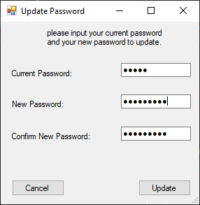

# StudentTestPortal

As part of being an varisty college student, I create a multiple choice test using visual studio. This would allow the lecturer to set and create a test allowing students to participate and complete the online test using the application developed.

I created a windows application which had checked all the requirements as requested with an fully funtional application.

The login screen is used by both lecturer and students and they both are sent to the correct portal repsectively.

Once the lecturer has logged in the applications sends the lecturer to the Teachers Dashboard.

The lecturer is able to create a test for the students to complete.

The lecturer can view marks of all previous students whom have completed the test.

The lecturer can register another student or lecturer using this screen, and the user will be given a defualt password.

Incase your account has been comprimised you are able to change your password.

This is the student main screen, where they are able to take a test

If the student decided to participate in the test they are taken to the take test screen, where they are able to complete the test.

Once the user completes the test they will be able to view the memo, and they percentage will be displayed.

